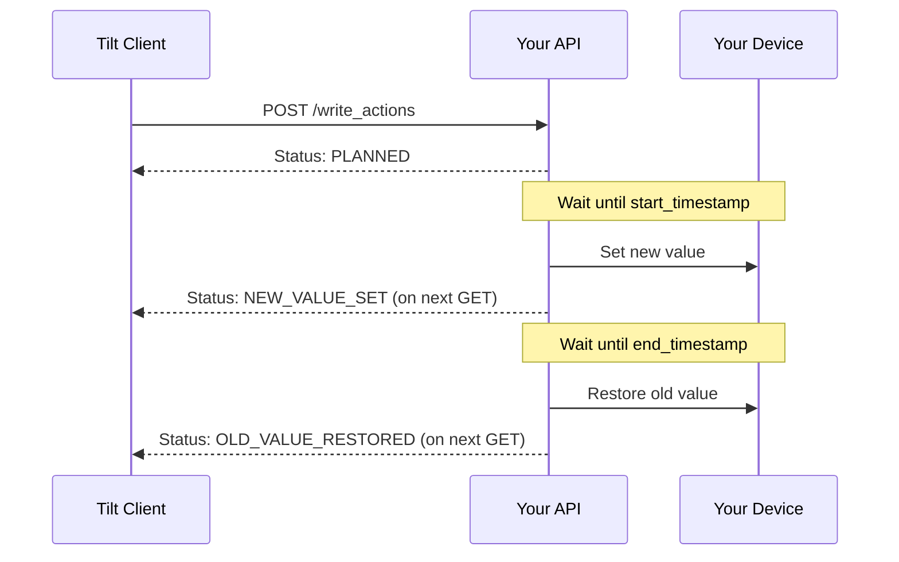

# Action Scheduling

This section describes how write actions should be handled in your API. When Tilt sends write actions to your API, they should be executed according to a specific schedule defined by start and end timestamps.

## Action States

A write action in your API should support the following states:

- **PLANNED**: The action has been accepted and is scheduled for execution
- **NEW_VALUE_SET**: The action has started and the new value has been applied
- **OLD_VALUE_RESTORED**: The action has completed and the original value has been restored
- **FAILED**: The action failed at some point in its lifecycle

## Lifecycle Sequence

The following diagram shows how Tilt will interact with your API for write actions:



## State Transitions

Your API should implement the following state transitions:

1. When Tilt submits a write action via POST `/write_actions`, your API should:
    - Validate the request, or return a response with status `FAILED`
    - Store the action
    - Return a response with status `PLANNED`

2. At the `start_timestamp`, your API should:
    - Attempt to apply the new value to the device
    - If successful, update the status to `NEW_VALUE_SET`
    - If it fails, update the status to `FAILED`

3. At the `end_timestamp`, your API should:
    - Attempt to restore the original value
    - If successful, update the status to `OLD_VALUE_RESTORED`
    - If it fails, update the status to `FAILED`

## Status Monitoring

Tilt will monitor the status of write actions using the GET `/write_actions` endpoint. Your API should:

- Return the current status of each action
- Allow filtering by various parameters (device_id, field_name, etc.)
- Provide accurate status updates reflecting the actual state of the device

## Example Implementation

Here's how the status might change over time for a write action:

```json
// Initial POST response from your API
{
  "action_id": "123e4567-e89b-12d3-a456-426614174000",
  "status": "PLANNED"
}

// GET response after start_timestamp
{
  "action_id": "123e4567-e89b-12d3-a456-426614174000",
  "status": "NEW_VALUE_SET"
}

// GET response after end_timestamp
{
  "action_id": "123e4567-e89b-12d3-a456-426614174000",
  "status": "OLD_VALUE_RESTORED"
}
```

## Error Handling

Your API should:

- Validate all timestamps and values before accepting an action
- Handle device communication failures gracefully
- Provide clear error messages when actions fail
- Maintain the original device state if an action fails
- Support retry mechanisms for failed actions 