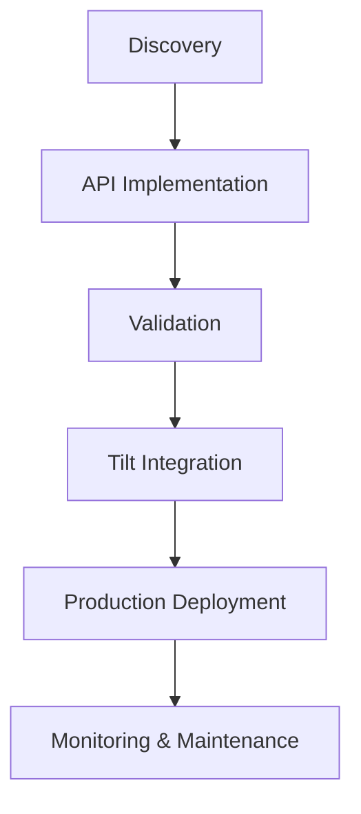

# Integration Journey

This section guides you through the process of integrating with Tilt's platform, from initial setup to production deployment.

Ready to start your integration journey? Begin with the [Discovery phase](discovery.md) to learn about Tilt's platform and concepts.